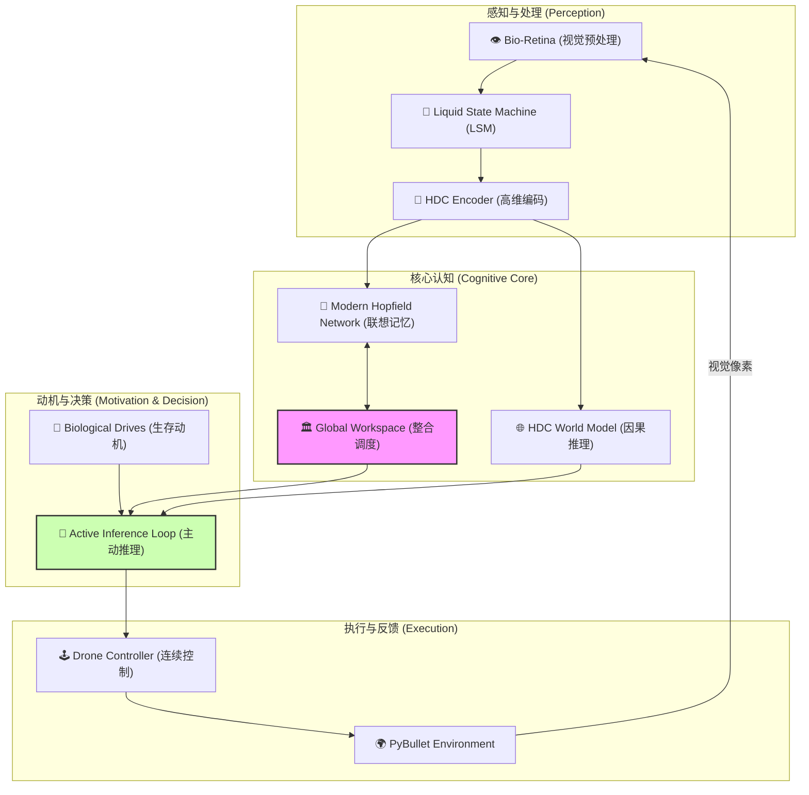

# 🌟 AION: Active Inference Online Network 🚁✨

[](https://www.python.org/)
[](https://pytorch.org/)
[](LICENSE)

> **AION** 是一款基于脑启发神经网络与主动推理（Active Inference）理论的自主智能体系统。它模拟了无人机在 3D 物理环境中的生存、探索与认知演变过程，将神经科学的前沿成果转化为可落地的控制逻辑。

---

## 🧠 核心架构图 (Brain-Inspired Architecture)



---

## ✨ 关键模块解析 🛠️

### 🌊 1. 液体状态机 (Liquid State Machine, LSM)
系统视觉系统的“动态储层”。
*   **实现**：基于 Nengo 开发的脉冲神经网络 (SNN)。
*   **特性**：具备 **稳态可塑性 (Homeostatic Plasticity)**，能根据输入光流动态调整阈值，实现视觉特征的鲁棒提取。

### 🧠 2. 现代霍普菲尔德网络 (Modern Hopfield Network, MHN)
系统的“海马体”，负责存储和检索概念。
*   **原理**：利用等效的注意力机制实现稠密联想存储。
*   **应用**：通过 **动态门控 (Dynamic Gating)** 存储新奇状态，实现对已知环境的快速召回与纠错。

### 🌐 3. 超维计算世界模型 (HDC World Model)
系统的“心智沙盘”，预测“动作 - 结果”对。
*   **核心**：利用超维向量 (HDC/HRR) 的代数运算模拟因果链条。
*   **学习**：通过 **运动碎语 (Motor Babbling)** 学习身体图式。

### 🎯 4. 主动推理 (Active Inference)
系统的决策引擎，核心思想是 **最小化预期自由能 (EFE)**。
*   **平衡**：在“开采 (探索充电桩解决饥饿)”与“探索 (减少环境不确定性)”之间寻求最优动态平衡。

---

## 🚀 快速上手指南 🔧

### 1. 环境安装
确保您的系统中已安装 Python 3.8+。

```bash
# 克隆仓库
git clone https://github.com/lkcfqy/AION.git
cd AION

# 安装依赖项
pip install -r requirements.txt
```

### 2. 预启动可视化 (可选但推荐)
本项目使用 **Visdom** 提供实时动态监控。

```bash
# 在独立终端启动 Visdom 服务器
python -m visdom.server
```
👉 访问 `http://localhost:8097` 开启你的“神谕”面板。

### 3. 开始模拟
运行主入口脚本，观察智能体从“婴儿”进化为“探险家”：

```bash
python scripts/run_agent.py
```

---

## 📂 目录结构 📁

*   `src/`：系统核心逻辑
    *   `lsm.py`：基于 Nengo 的液体状态机。
    *   `mhn.py`：现代 Hopfield 网络存储器。
    *   `hrr.py` / `adapter.py`：超维计算与编码接口。
    *   `environment_pybullet.py`：基于物理引擎的仿真封装。
*   `scripts/`：训练与运行脚本
    *   `run_agent.py`：**主程序**，执行主动推理闭环。
    *   `pretrain_world_model.py`：世界模型预训练脚本。
*   `assets/`：存放预训练模型及仿真资源。

---

## 🧬 生命周期演示 🐣 ➡️ 🦅

1.  **目标印记 (Goal Imprinting)**：智能体首次感知“能量源”并将其编码为核心目标向量。
2.  **运动碎语 (Motor Babbling)**：通过随机摆动学习控制指令与视觉位移之间的映射关系。
3.  **生存长征 (Survival Mode)**：电量降低时，主动推理系统将接管控制，引导无人机穿越障碍寻找能量站。

---

> 由 **Antigravity** 审计并维护 🛸✨
